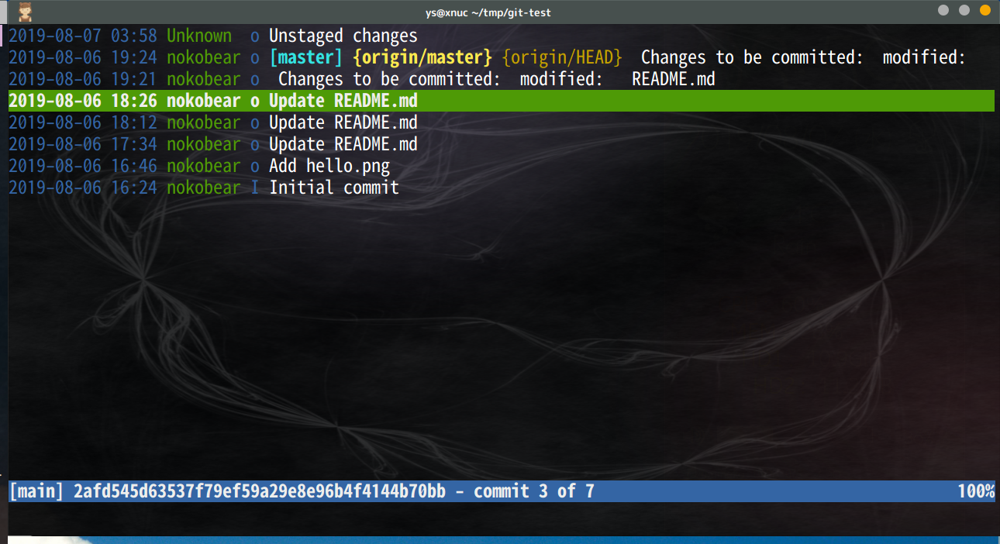
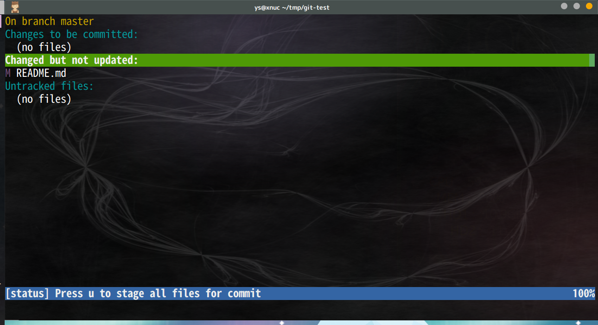
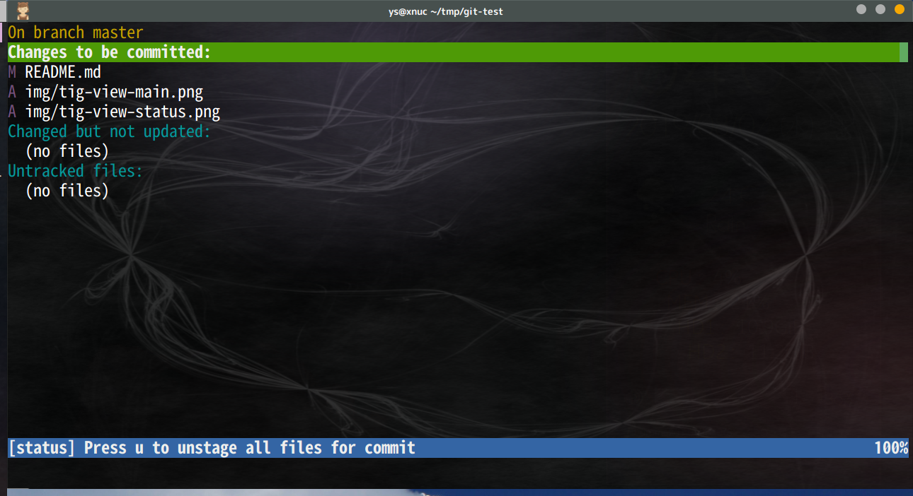
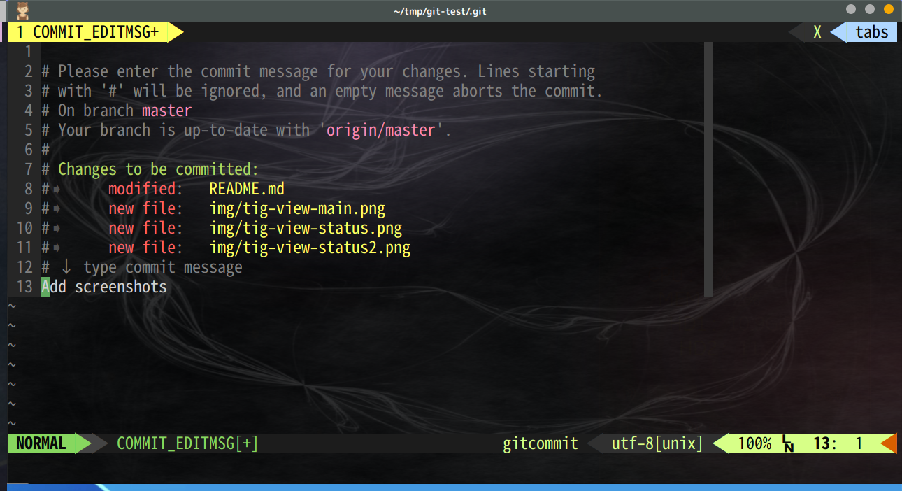

# git-test
How to use git effectively. (This is my memo.)

## git frontends
- browser (github)
- git (local)
- tig (local)

## git commands

clone
```sh
git clone https://github.com/nokobear/git-test
```

view

```sh
git log
git status
```

action

```sh
git add .
git commit -m "message"
git tag 0.1.0 105e2e57fff64791b5899f569b30272ae063f4ef
```

push

```sh
git push origin master
```

branch

```sh
git branch                          # view
git branch dev1                     # create new branch "dev1"
git checkout dev1                   # switch to branch "dev1"
git checkout master; git merge dev1 # merge (master = master + dev1)
```

## push without password

4 methods to do it.

1. use ssh
2. use https and cached password
3. use https and .netrc (bad method in the point of security.)
4. use https and .netrc.gpg

1-3. omit  
see:  
[authenticating-with-github-from-git](https://help.github.com/articles/set-up-git#next-steps-authenticating-with-github-from-git)

### 4. use https and .netrc.gpg

create `~/.netrc`

```sh
touch ~/.netrc
chmod 600 ~/.netrc
vim ~/.netrc
```

~/.netrc

    machine github.com
      login nokobear
      password xxxxxxxxxxxx
      protocol https
    
    machine gist.github.com
      login  nokobear
      password xxxxxxxxxxx
      protocol https

push test.

```sh
cd git-test
git push origin master
```

gpg encrypt.

```sh
gpg --gen-key
# ( keytype:RSA and RSA, bitlength:2048, limit:0day(unlimited),
#   name:nokobear, email:email_address, comment:
#   password: )
gpg -e -r email_address ~/.netrc
rm ~/.netrc
```

setup git-credential-netrc

```sh
# (download to ~/bin)
curl -o ~/bin/git-credential-netrc https://raw.githubusercontent.com/git/git/master/contrib/credential/netrc/git-credential-netrc
chmod 755 ~/bin/git-credential-netrc
git config --global credential.helper "netrc -f ~/.netrc.gpg -v"
```

modify ~/.netrc (optional)

```sh
# (decrypt)
gpg -d ~/.netrc.gpg > ~/.netrc
vim ~/.netrc
# (encrypt)
gpg -e -r email_address ~/.netrc
rm ~/.netrc
```

## tig
```sh
tig         # view-main(m)
tig status  # view-status(s)
```

### view-main


    jk: select
    s:  view-status
    q:  quit (or return)
    h:  help

### view-status


    jk: select
    u:  git add (or undo git add)
    C:  git commit
    q:  quit (or return)

<kbd>u</kbd> -> git add


<kbd>C</kbd> -> commit


    vim
    :wq  commit
    :q!  cancel

## test show image


